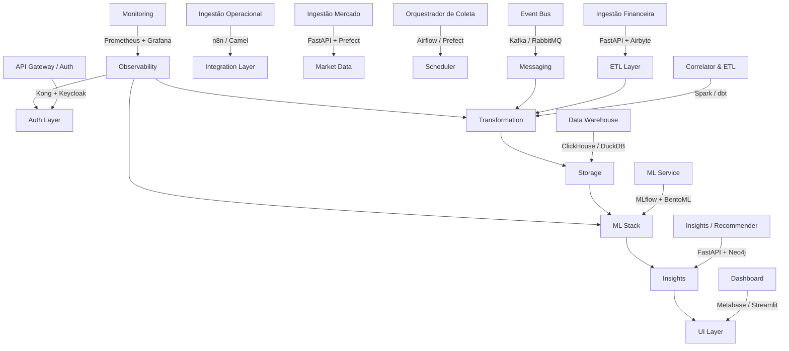

# 🔧 Sugestão de Ferramentas Open Source — Arquitetura IMPORTAÚ

Este documento complementa o desenho de microsserviços proposto, indicando **ferramentas open source** que podem ser **usadas ou integradas** para implementar cada parte da solução.

---

## Visão Geral

A arquitetura do sistema é composta por microsserviços especializados para ingestão, correlação, aprendizado de máquina e visualização.  
A tabela a seguir apresenta ferramentas sugeridas para **construir** ou **substituir** componentes, maximizando o uso de software open source maduro.

---

## 🧩 Ferramentas por Microsserviço

| # | Microsserviço | Categoria | Ferramentas / Tecnologias sugeridas | Observações |
|---|----------------|------------|------------------------------------|--------------|
| **1** | **API Gateway / Auth** | API Gateway + Autenticação | - **Kong Gateway** (JWT/OAuth2)    - **Keycloak** (IAM, OpenID Connect) | Kong faz controle de tráfego e autenticação. Keycloak gerencia usuários e tokens OIDC. |
| **2** | **Ingestão Financeira (Open Finance Adapter)** | Integração / ETL leve | - **FastAPI** (API + agendador)   - **Airbyte** (conectores Open Finance)   - **Pandas / DuckDB** | FastAPI ideal para APIs leves; Airbyte para pipelines configuráveis. |
| **3** | **Ingestão Operacional (Internal Adapters)** | Integração interna | - **n8n.io**, **Apache Camel**, ou **Mule CE** | Permitem orquestração visual e integração sem muito código. |
| **4** | **Ingestão Mercado (SISBACEN Adapter)** | Coleta de dados externos | - **FastAPI + Celery + Requests**   - **Prefect** | Prefect lida com retries e agendamento. |
| **5** | **Orquestrador de Coleta / Scheduler** | Agendador / Workflow | - **Apache Airflow** ou **Prefect** | Ideal para controlar fluxos e dependências entre jobs. |
| **6** | **Correlator & ETL** | Processamento e correlação | - **Apache Spark** ou **Flink**   - **dbt Core**   - **Python + Pandas** (para MVP) | Spark escalável, dbt para modelagem e versionamento de transformações. |
| **7** | **Data Warehouse / Storage** | Banco analítico | - **ClickHouse**, **DuckDB**, **PostgreSQL + TimescaleDB**   - **MinIO** (data lake) | ClickHouse é rápido; DuckDB ótimo para protótipos locais. |
| **8** | **ML Service (Batch + Online)** | Machine Learning | - **MLflow** (gestão de modelos)   - **BentoML / FastAPI** (serving)   - **scikit-learn**, **XGBoost**, **Prophet**, **PyTorch** | MLflow e BentoML formam stack completa de ML open source. |
| **9** | **Insights & Recommendations** | Pós-processamento / API insights | - **FastAPI**   - **Neo4j** (recomendações em grafo)   - **RedisJSON** (cache) | Neo4j modela dependências entre produtos e fornecedores. |
| **10** | **Dashboard / Reporting** | Visualização de dados | - **Metabase**, **Superset**, **Grafana**   - **Streamlit** | Metabase fácil de usar; Streamlit útil para visualizações personalizadas. |
| **11** | **Microsserviços de Domínio** | CRUD / APIs | - **FastAPI** ou **Spring Boot**   - **PostgreSQL** | FastAPI tem OpenAPI automático e alta performance. |
| **12** | **Event Bus / Message Broker** | Mensageria | - **Apache Kafka**   - **RabbitMQ**   - **Redpanda** | Kafka para eventos em alta escala; RabbitMQ mais simples e leve. |
| **13** | **Monitoring & Logging** | Observabilidade | - **Prometheus + Grafana** (métricas)   - **ELK Stack** (Elasticsearch, Logstash, Kibana)   - **Jaeger** (tracing) | Loki pode substituir ELK para logs leves. |

---

## 🧱 Stack Open Source Consolidada (para MVP)

| Camada | Ferramentas |
|--------|--------------|
| **APIs / Microsserviços** | FastAPI + PostgreSQL |
| **Autenticação / Gateway** | Keycloak + Kong |
| **Orquestração / ETL** | Prefect |
| **Mensageria** | Kafka |
| **Armazenamento / OLAP** | ClickHouse |
| **Machine Learning** | scikit-learn + MLflow + BentoML |
| **Dashboards** | Metabase + Streamlit |
| **Monitoramento** | Prometheus + Grafana |
| **Infraestrutura** | Docker Compose / Kubernetes (Helm Charts) |

---

## 🔍 Diagrama — Microsserviços e Ferramentas (Mermaid)

---

## ⚙️ Benefícios da Stack Proposta
- 100% **open source** (sem custos de licença).  
- Integrável via REST, Kafka ou AMQP.  
- Suporte ativo e documentação madura.  
- Fácil de **containerizar** e orquestrar via Docker/Kubernetes.  
- Permite evolução modular — cada microserviço pode ser trocado sem impactar o restante.

---

## 📈 Próximos Passos
1. Criar `docker-compose.yml` integrando: FastAPI, Kafka, ClickHouse, MLflow e Metabase.  
2. Definir templates OpenAPI (YAML) para os serviços **Ingestão Financeira**, **Correlator**, e **ML Service**.  
3. Configurar Prometheus e Grafana para observabilidade básica.  
4. Implantar Keycloak para autenticação unificada e roles por usuário.

---

**Arquivo gerado:** documento complementar à arquitetura IMPORTAÚ com stack open source sugerida.
