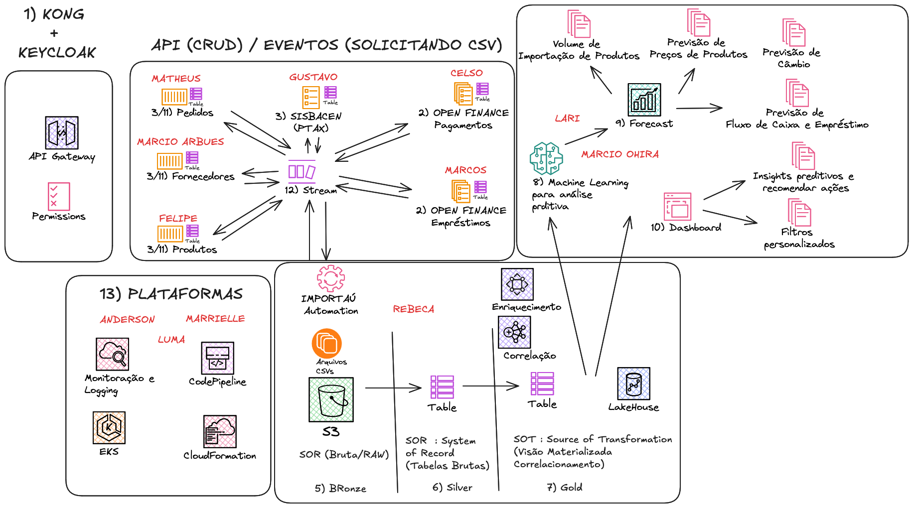

# openfinance

Exemplo Prático de PROJECT BASED LEARNING

Motivação:
- O objetivo estratégico é construir uma solução baseada em OPEN FINANCE que gerencie as operações e dados analíticos de todos os Bancos, visando apoiar a empresa na tomada de decisões para eficiência operacional e expansão de mercados. Ao fornecer insights detalhados sobre tendências de importação, demandas de mercado, pagamentos efetuados, câmbios e preços praticados, possíveis empréstimos de curto prazo para melhoria no fluxo de caixa, dentre outros; essa solução permitirá que a empresa analise seu fluxo financeiro, reduzindo riscos e otimizando decisões ágeis.

Tarefas:

- Realizar a Análise de Funcionalidades.
- Definir Cenários de Testes (BDD, ATDD, TDD).

## Domain Story Telling:

## Projeto da Solução:

