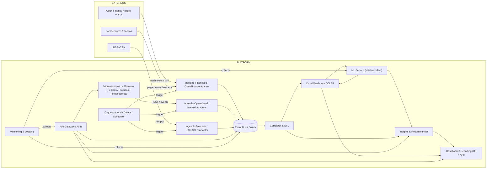

# Arquitetura Simplificada — Plataforma IMPORTAÚ (Microsserviços)

**Base:** proposta de microsserviços e arquitetura simplificada para a plataforma de Gestão de Comércio Exterior (IMPORTAÚ LTDA), baseada na especificação do projeto fornecido. 

---

## Visão Geral
Esta arquitetura separa responsabilidades em microsserviços especializados para:
- coletar e normalizar dados externos (Open Finance, SISBACEN),
- integrar dados operacionais internos (Pedidos/Produtos/Fornecedores),
- correlacionar e preparar dados para ML,
- fornecer dashboards e APIs para usuários (Analista, Marketing, CFO).

### Objetivos principais
- Escalabilidade e isolamento por domínio.
- APIs bem definidas (OpenAPI/Swagger) por serviço.
- Pipelines para ingestão, validação e correlação de dados.
- Serviços de ML desacoplados (batch / realtime).
- Observabilidade, autenticação e filas para integração assíncrona.

---

## Lista proposta de Microsserviços
1. **API Gateway / Auth**  
2. **Ingestão Financeira (OpenFinance Adapter)**  
3. **Ingestão Operacional (Internal Adapters)**  
4. **Ingestão Mercado (SISBACEN Adapter)**  
5. **Orquestrador de Coleta (Data Collector / Scheduler)**  
6. **Correlator & ETL**  
7. **Data Warehouse / Storage (DB + OLAP)**  
8. **ML Service (Batch + Online Inference)**  
9. **Insights & Recommendations Service**  
10. **Dashboard / Reporting Service**  
11. **Microservices Domain (Pedidos / Fornecedores / Produtos)** — podem existir como serviços separados ou já serem sistemas existentes  
12. **Event Bus / Message Broker**  
13. **Monitoring & Logging**  

Decisões seguem os requisitos e regras de negócio extraídos do seu documento (ex.: correlação transações ↔ pedidos, coleta via Open Finance, previsões de câmbio/fluxo). 

---

## Diagrama de arquitetura (Mermaid)

---

## Contratos API / OpenAPI (resumo por microservice)
Abaixo há um resumo dos endpoints e recursos que cada microsserviço **deveria** expor via OpenAPI/Swagger. Sugestão de padrões: usar JSON:API ou RESTful com versionamento `/v1`.

### 1) API Gateway / Auth
**Função:** Autenticação (OAuth2 / JWT), roteamento e rate-limiting.  
**Endpoints (ex.):**
- `POST /v1/auth/token` — token (OAuth2 password / client_credentials)
- `POST /v1/auth/refresh`
- Proxy para `/v1/*` dos microsserviços

**Swagger:** especificação com segurança `oauth2` & `bearerAuth`.

---

### 2) Ingestão Financeira (OpenFinance Adapter)
**Função:** conectar a plataformas Open Finance, agendar coleta, normalizar transações.  
**Endpoints (API interna / admin):**
- `GET /v1/status` — health
- `POST /v1/collect` — dispara coleta manual (body: {bank, startDate, endDate})
- `GET /v1/collections/{id}` — status da coleta
- `GET /v1/transactions?start=&end=&bank=&type=` — query transações normalizadas

**Eventos publish (Event Bus):**
- `financial.transaction.created` — payload: transaction normalized

**Swagger:** schemas para `Transaction`, `Account`, `CollectionJob`.

---

### 3) Ingestão Operacional (Internal Adapters)
**Função:** consumir APIs internas de Pedidos/Produtos/Fornecedores (pull / subscribe).  
**Endpoints:**
- `POST /v1/collect` — solicita sincronização de um microsserviço interno
- `GET /v1/entities/{type}?filter=...` — retorna dados normalizados (orders, products, suppliers)

**Eventos publish:**
- `order.created`, `product.updated`, `supplier.updated`

**Swagger:** modelagem de Order / Product / Supplier.

---

### 4) Ingestão Mercado (SISBACEN Adapter)
**Função:** coletar taxas de câmbio e fatores de sazonalidade.  
**Endpoints:**
- `POST /v1/collect` — executar coleta histórica ou pontual
- `GET /v1/exchange_rates?start=&end=&pair=USD_BRL`
- `GET /v1/seasonality?metric=&period=monthly`

**Eventos publish:**
- `market.exchange_rate.updated`, `market.seasonality.updated`

**Swagger:** schemas para `ExchangeRate`, `SeasonalityFactor`.

---

### 5) Orquestrador de Coleta (Data Collector / Scheduler)
**Função:** agendar jobs, coordenar execuções (cron, cadência), políticas de retry.  
**Endpoints:**
- `GET /v1/jobs`
- `POST /v1/jobs` — criar job (payload: adapter, schedule, params)
- `POST /v1/jobs/{id}/run` — executar imediato

**Swagger:** Job schedule, run history.

---

### 6) Correlator & ETL
**Função:** consumir eventos/filas, aplicar regras de correlação (transação ↔ pedido ↔ pagamento), enriquecimento e qualidade de dados.  
**Endpoints (admin / query):**
- `POST /v1/correlate` — executar correlação ad-hoc
- `GET /v1/correlations?status=uncorrelated&limit=...`
- `GET /v1/correlations/{id}`

**Outputs:**
- escreve no DW e publica `data.correlated` com score/confiança.

**Swagger:** schemas `CorrelationResult`, `CorrelationError`.

---

### 7) Data Warehouse / Storage
**Função:** armazenar dados históricos normalizados e agregados (OLAP), servir análises e cubos.  
**APIs (read-only / admin):**
- `GET /v1/aggregates/import_volume?start=&end=&groupBy=category`
- `GET /v1/transactions/{id}`

**Swagger:** modelos de agregados.

---

### 8) ML Service (Batch + Online Inference)
**Função:** treinar modelos (batch), servir previsões (online), versionamento de modelos.  
**Endpoints:**
- `POST /v1/train` — iniciar treinamento (payload: dataset_ref, params)
- `GET /v1/train/{id}/status`
- `POST /v1/predict/cashflow` — predict cashflow (payload: features)
- `POST /v1/predict/category_growth`
- `GET /v1/models` — listar modelos

**Events:** `ml.prediction.completed` (insights persistidos).

**Swagger:** especificar input feature-schema e output `Prediction {value, confidence, model_version}`.

---

### 9) Insights & Recommendations Service
**Função:** transformar previsões em recomendações acionáveis (empréstimos, hedging, estoque).  
**Endpoints:**
- `GET /v1/insights?entity=category&period=next_quarter`
- `POST /v1/recommendations/evaluate` — simulação

**Swagger:** schemas `Insight`, `Recommendation`.

---

### 10) Dashboard / Reporting Service
**Função:** fornecer UI e APIs para dashboards, filtros, exportação.  
**Endpoints (user-facing):**
- `GET /v1/dashboard/volume_import?filters=...`
- `GET /v1/dashboard/financial_overview?filters=...`
- `GET /v1/dashboard/predictions?type=currency`

**Swagger:** modelos de `DashboardResponse`, `Filter`.

---

### 11) Microsserviços de Domínio (Pedidos / Produtos / Fornecedores)
**Função:** origem dos dados operacionais (pode ser legado ou novo serviço).  
**Endpoints típicos:**
- `GET /v1/orders`, `GET /v1/orders/{id}`
- `GET /v1/products`, `GET /v1/suppliers`

**Swagger:** contratos já existentes / adaptadores.

---

### 12) Event Bus / Message Broker
**Função:** transporte assíncrono entre serviços (Kafka, RabbitMQ).  
**Tópicos sugeridos:** `financial.transaction.created`, `order.created`, `data.correlated`, `ml.prediction.completed`, `insight.created`.

---

### 13) Monitoring & Logging
**Função:** métricas (Prometheus), traces (Jaeger), logs centralizados (ELK).  
**Endpoints:** métricas `/metrics`, traces `/trace`.

---

## Observações de Segurança e Nível Operacional
- **Dados sensíveis**: tokens Open Finance e PII devem ser criptografados em trânsito e repouso.  
- **Consentimento**: respeitar regras de Open Finance (consent API), cache com TTL curto.  
- **Auditoria**: logs de who-did-what para coletas e correlações.  
- **Escalonamento**: Separar ML em infra dedicada (GPU/TPU) se necessário.

---

## Roadmap mínimo de entregas (sugestão)
1. MVP: Ingestão Financeira (1 banco) + Ingestão Operacional (Pedidos) + Correlator + DW + simples Dashboard de volume.  
2. Fase 2: SISBACEN, ML batch para previsão de categoria e câmbio.  
3. Fase 3: Recomendações automáticas + ML online + robustez (retry, idempotency, circuit-breaker).

---

## Breve descrição de cada microservice e funcionalidades (resumo)
> As descrições detalhadas de contratos e modelos foram extraídas dos fluxos e regras de negócio no documento do projeto. 

- **API Gateway / Auth** — Autenticação, autorização, roteamento, quota.
- **Ingestão Financeira** — integração Open Finance, normalização, detectar e eliminar registros repetidos, publish events.
- **Ingestão Operacional** — adaptadores para Pedidos/Produtos/Fornecedores, sync endpoints.
- **Ingestão Mercado** — coleta de taxas, seasonality, provisionamento histórico.
- **Orquestrador de Coleta** — criação de jobs, agendamento, dashboard de jobs.
- **Correlator & ETL** — regras de correlação (Transação ↔ Pedido ↔ Fornecedor), enriquecimento.
- **Data Warehouse / Storage** — OLAP, agregações, retenção, endpoints de consulta.
- **ML Service** — treinos, inferência, avaliação, versionamento de modelos.
- **Insights & Recommendations** — transformar predições em ações (e.g., necessidade empréstimo).
- **Dashboard / Reporting** — UI, endpoints para filtros e visualizações.
- **Microsserviços de Domínio** — origem dos dados operacionais.
- **Event Bus** — backbone assíncrono.
- **Monitoring** — métricas, traces, alertas.

---

## Próximos passos (se quiser eu faço:)
- Gerar modelos OpenAPI (YAML/JSON) iniciais para os principais serviços (ex.: Ingestão Financeira, Correlator, ML).
- Gerar esqueleto de repositório com Docker Compose + exemplos de topics no Kafka / RabbitMQ.
- Diagramas detalhados por serviço (sequência de eventos para uma coleta completa).

---

**Arquivo gerado:** este documento em Markdown (.md).  
